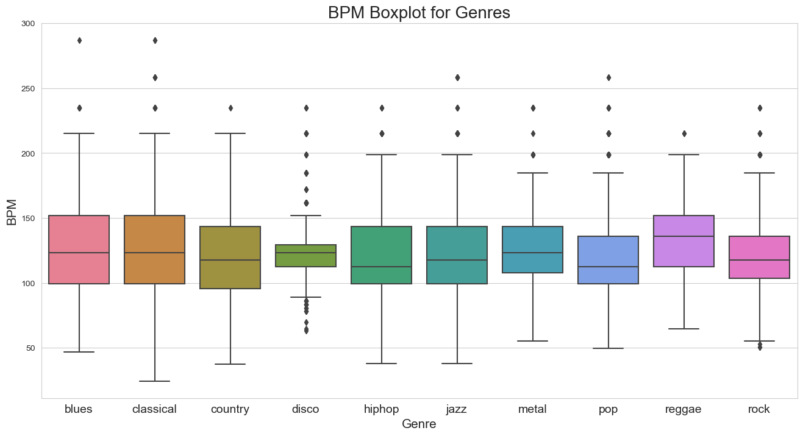
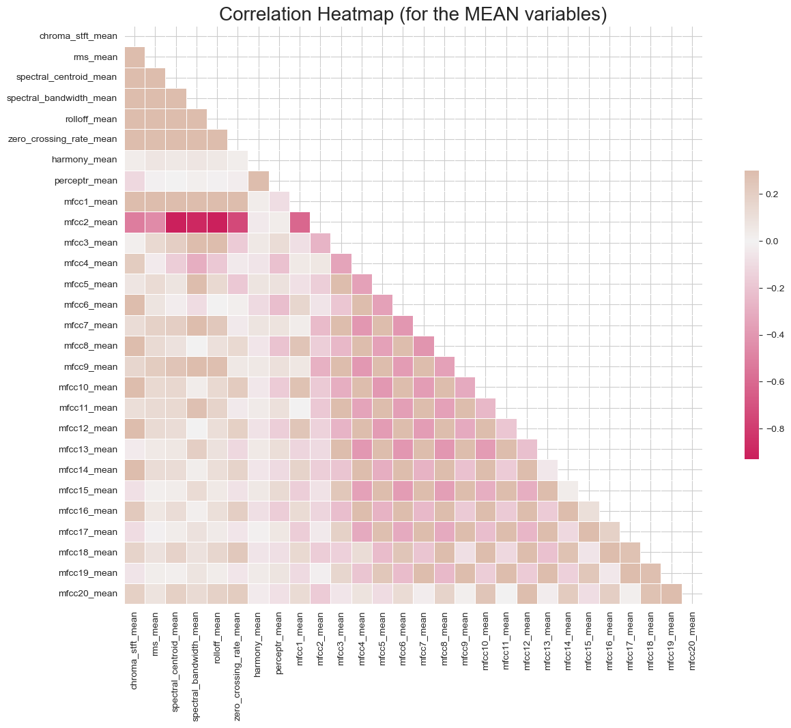
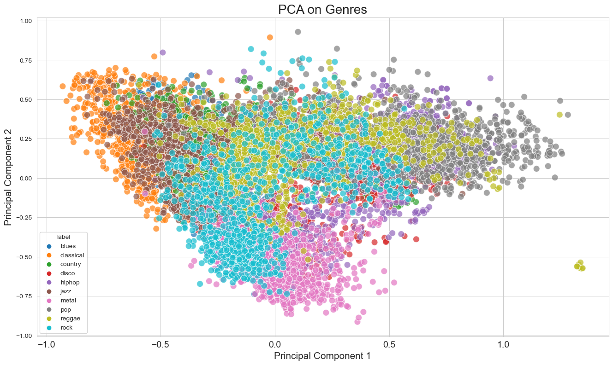
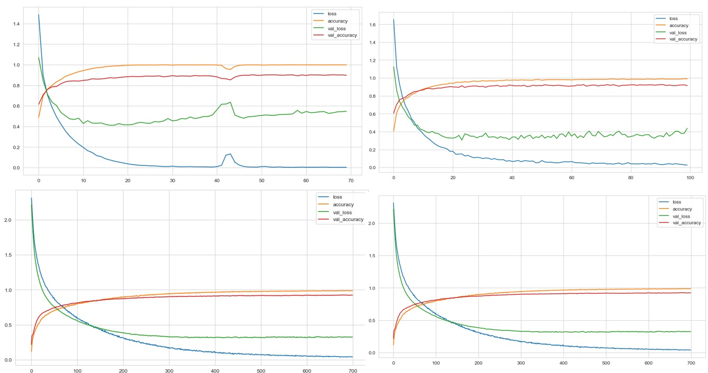
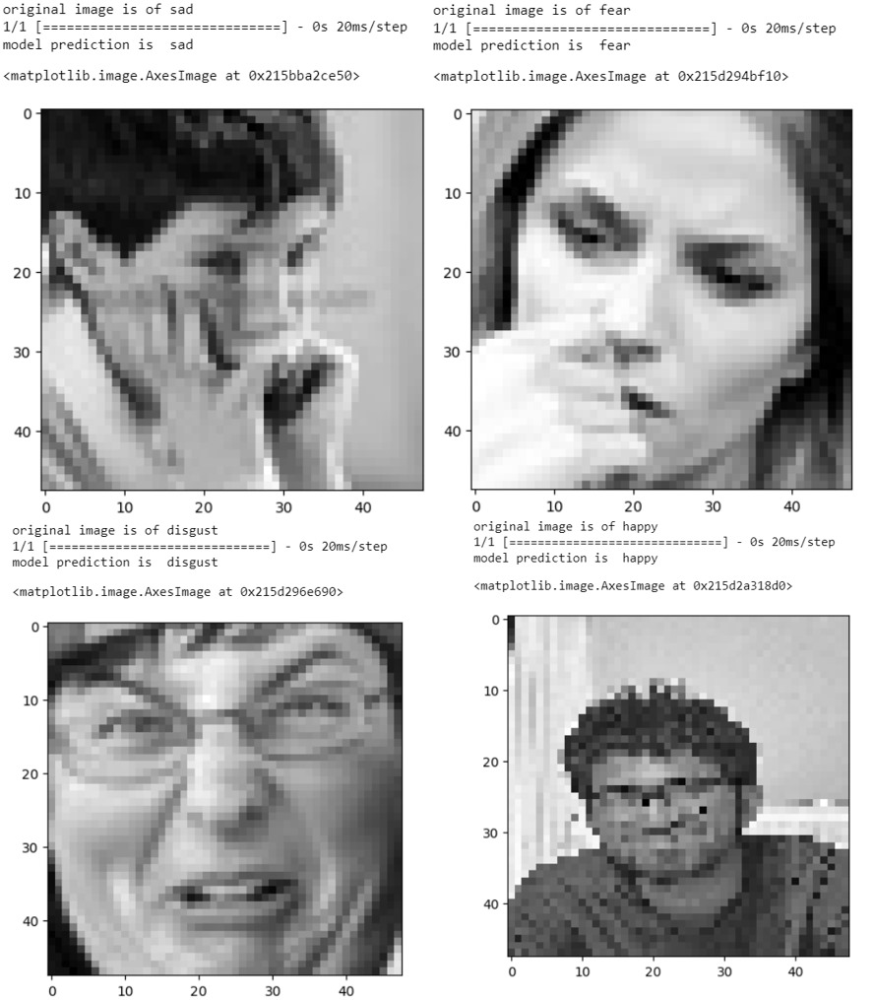
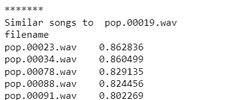

# Music-Genre-Classification-Recommendation.io

## Team Members
- Shaun Noronha
- Sanjeeth Chakkrasali
- Khushita Joshi
- Alessandra Serpes
- Sankalp Vyas

## Background and Motivation
Our project, the Advanced Music Genre Classification System, is inspired by the successes of platforms like Spotify, which utilize machine learning not only to enhance music discovery but also to personalize user experiences. By developing a system that incorporates cutting-edge audio analysis and machine learning models, we aim to improve the accuracy and efficiency of music genre classification. Additionally, by integrating mood recognition technology, our system will offer personalized music recommendations, enriching the user's listening experience based on their current emotional state.

## Dataset
### GTZAN Dataset - Music Genre Classification
We used the data available on [GTZAN](https://www.kaggle.com/datasets/andradaolteanu/gtzan-dataset-music-genre-classification).

The GTZAN dataset is a collection of 1000 audio tracks equally distributed across 10 genres, making it one of the most commonly used datasets for evaluating music genre classification systems. Each track is 30 seconds long, providing a substantial variety of samples for training deep learning models.

Our Datasets contain 10 genres:
- Blues
- Classical
- Country
- Disco
- Hip-hop
- Jazz
- Metal
- Pop
- Reggae
- Rock

### Features
Here is a brief description of each feature included in the dataset:

1. **Chroma STFT (Short-Time Fourier Transform) Mean:** Measures the intensity of different pitches in a music track, providing a representation of the audio in terms of its harmonic content across 12 different pitch classes.
2. **RMS (Root Mean Square) Mean:** Indicates the average power or loudness of the audio signal.
3. **Spectral Centroid Mean:** Represents the "center of mass" of the spectrum, giving a sense of the brightness of a sound.
4. **Spectral Bandwidth Mean:** Measures the width of the band of light at half the peak maximum and effectively indicates the range of frequencies present in the sound.
5. **Rolloff Mean:** The frequency below which a specified percentage (typically 85% to 95%) of the total spectral energy lies, highlighting the shape of the audio spectrum.
6. **Zero Crossing Rate Mean:** The rate at which the signal changes signs, which can indicate the noisiness or the complexity of a sound.
7. **Harmony Mean:** Extracts the harmonic components of the audio, which are important for the perception of musical notes.
8. **Perceptual Sharpness Mean:** Measures the sharpness or brightness of the audio, which affects how listeners perceive the "edge" or clarity of a sound.
9. **Tempo:** The speed at which a piece of music is played, calculated in beats per minute (BPM).
10. **MFCC (Mel Frequency Cepstral Coefficients) Mean:** Describes the overall shape of the spectral envelope and is widely used in audio signal processing and speech recognition for timbre and speech clarity characterization.

## Exploratory Data Analysis
1. **BPM Boxplot for Genres**
   
   The boxplot highlights varied BPM distributions among genres, suggesting tempo as a key feature in genre classification.
   - **Blues and Jazz:** Both show a wide range of BPMs with several outliers, indicating diverse substyles within each genre that range from slow to fast tempos.
   - **Classical and Reggae:** These genres exhibit narrower BPM ranges, which align with their more consistent and genre-specific tempos.
   - **Country and Pop:** Both have moderate BPM ranges around 120, typical for genres that balance slow ballads with faster dance tracks.
   - **Disco and Metal:** These genres stand out with higher medians and wider ranges, reflecting their energetic and fast-paced natures.
   - **Hip Hop and Rock:** Display moderate to wide BPM distributions, accommodating a variety of subgenres from laid-back to aggressive styles.

3. **Correlation Heatmap (for the MEAN variables)**
   
   This correlation heatmap showcases the relationships between various mean variables extracted for music genre classification. Below are key observations derived from the analysis:
   - **Strong Interrelationships:**
     - Many Mel-Frequency Cepstral Coefficients (MFCCs) exhibit moderate to strong correlations with each other.
     - This suggests redundancy in the information they provide, potentially impacting model complexity and effectiveness.
   - **Lower Correlations with Non-MFCC Features:**
     - Features such as chroma_stft_mean, rms_mean, and spectral_centroid_mean show lower correlations with MFCCs.
     - Combining these features with MFCCs could provide complementary information, enhancing genre classification model accuracy.
   - **RMS and Perceptual Features:**
     - The root mean square (rms_mean) and perceptual mean (percept_mean) show limited correlation with MFCCs.
     - Including these features could be vital for understanding dynamics and clarity, which are genre-defining characteristics.
   - **Spectral Features' Interaction:**
     - The spectral centroid and bandwidth (spectral_centroid_mean, spectral_bandwidth_mean) demonstrate a noteworthy relationship.
     - This interaction could aid in distinguishing genres based on their spectral content.

5. **PCA on Genres**
   
   The PCA plot displayed here illustrates the distribution of music genres based on the reduction of multiple audio feature dimensions into two principal components. Below are key observations derived from the analysis:
   - **Distinct Clusters:**
     - Several genres, particularly classical and metal, form distinct clusters, indicating that their audio features are notably different from other genres. 
     - This suggests that PCA can effectively reduce feature space while retaining significant genre-specific characteristics.
   - **Overlap Among Genres:**
     - Genres like rock, pop, and disco show considerable overlap.
     - This could be due to similarities in their musical structure, such as beat, tempo, and instrumentation, which are not fully separable by the first two principal components.
   - **Spread and Density:**
     - The spread and density of points within each genre vary.
     - Jazz and blues, for example, exhibit a broad dispersion, suggesting a higher intra-genre variability compared to more tightly clustered genres like classical.
   - **Potential for Classification:**
     - The clear separation of some genre clusters from others provides a promising basis for classification models.
     - However, the overlapping areas will likely require more sophisticated, possibly non-linear, models to achieve high accuracy.

## Implementation
We used the data for our model as follows:
- **Training Data:** 70% of the Data.
- **Test Data:** 30% of the Data.

For the demo, we have implemented 4 models:

### Model 1: Sequential Dense Model
- **Architecture:**
  - Consists of three densely connected layers with 256, 128, and 64 neurons, respectively, each followed by ReLU activation.
  - Concludes with a softmax layer for classification into 10 genres.
- **Training:**
  - Trained over 70 epochs using the Adam optimizer.
- **Accuracy:**
  - Achieved a validation accuracy of approximately 90.29%.

### Model 2: Enhanced Dense Model with Dropout
- **Architecture:**
  - Incorporates a denser setup with initial 512 neurons, followed by layers with 256, 128, and 64 neurons, each equipped with ReLU activation.
  - Dropout layers with a dropout rate of 0.2 follow each dense layer to prevent overfitting.
  - Finishes with a softmax output layer.
- **Training:**
  - Conducted training for 100 epochs using the Adam optimizer.
- **Accuracy:**
  - Reached a validation accuracy of about 92.62%.

### Model 3: Similar Enhanced Dense Model with SGD
- **Architecture:**
  - Similar to Model 2, with layers of 512, 256, 128, and 64 neurons, each followed by a dropout of 0.2.
  - ReLU activation function for all layers, capped with a softmax layer for genre classification.
- **Training:**
  - Extensively trained over 700 epochs using Stochastic Gradient Descent (SGD) optimizer for robust convergence.
- **Accuracy:**
  - Achieved a maximum validation accuracy of 92.82%.

### Model 4: High-Capacity Dense Model with Increased Dropout
- **Architecture:**
  - Begins with a high neuron count of 1024, followed by subsequent layers of 512, 256, 128, and 64 neurons, all using ReLU activation.
  - Each layer is followed by a higher dropout rate of 0.3 to enhance the model's generalization capabilities.
  - Concludes with a softmax classification layer.
- **Training:**
  - Trained for 500 epochs with the RMSprop optimizer, optimizing for more complex patterns.
- **Accuracy:**
  - Achieved the highest validation accuracy of 94.03% among the models, showcasing its effectiveness in handling overfitting while maintaining accuracy.

## Mood Detection Component
In the Advanced Music Genre Classification System, mood detection plays a crucial role in enhancing the music discovery experience by aligning genre recommendations with the listener's emotional state. Here's the implementation of the mood detection component of the project:

### Model Architecture
- **Input Layer:**
  - Images are preprocessed to a uniform size of 48x48 pixels and converted to grayscale to reduce computational complexity while retaining necessary features for effective emotion recognition.
- **Convolutional Layers:**
  - The first layer consists of 128 filters with a kernel size of 3x3, using ReLU activation. This layer is followed by a MaxPooling layer with a pool size of 2x2 to reduce spatial dimensions.
  - The second set includes 256 filters with the same kernel size and activation, followed by another MaxPooling layer.
  - Subsequent layers increase the number of filters to 512, maintaining the kernel size and using ReLU activation, with additional MaxPooling layers after each convolutional layer.
- **Dropout Layers:**
  - Dropout layers with a rate of 0.4 are applied after each pooling layer to prevent overfitting, effectively reducing the risk of co-adaptation among neurons.
- **Flattening Layer:**
  - The multi-dimensional output from the convolutional and pooling layers is flattened into a one-dimensional array to serve as input for the dense layers.
- **Dense Layers:**
  - After flattening, the network includes:
    - A dense layer with 512 neurons and ReLU activation.
    - A second dense layer with 256 neurons, also activated by ReLU.
    - Both layers include a dropout rate of 0.3 to further combat overfitting.
- **Output Layer:**
  - The final layer is a softmax layer with 7 outputs, each corresponding to a different emotional state.

### Classification Labels
The model classifies each input image into one of seven emotional states, which are:
1. Angry
2. Disgust
3. Fear
4. Happy
5. Neutral
6. Sad
7. Surprise

These labels are crucial for the system as they directly influence the music genre recommendation logic, where each mood is associated with specific genres to enhance the listener's experience based on their emotional state.

### Recommendation Component of the Advanced Music Genre Classification System
#### Overview
The recommendation component of the Advanced Music Genre Classification System leverages cosine similarity to offer music genre suggestions that align closely with a selected track, enhancing the user's music discovery experience.

#### Detailed Explanation
##### Feature Scaling
- To ensure that all features contribute equally to the similarity calculation, the data is normalized using standard scaling. This process transforms the feature data to have a mean of zero and a standard deviation of one.
##### Cosine Similarity Computation
- The core of the recommendation engine is the cosine similarity measure, which computes the cosine of the angle between two vectors. This step generates a similarity matrix representing the musical similarity between each pair of tracks in the dataset.
##### Recommendation Generation
- When a user selects a track, the system identifies the top five tracks with the highest cosine similarity scores, suggesting these as recommendations. This is achieved by sorting the similarity values in descending order and selecting the top entries.

##### Implementation Results

## Conclusion & Future Work
The Advanced Music Genre Classification System represents a significant advancement in the application of machine learning to the field of music analysis. By leveraging a comprehensive approach that includes genre classification, mood recognition, and music recommendation, this system not only categorizes music more accurately but also enhances user interaction by tailoring recommendations to their emotional state and musical preferences. The integration of various techniques—from deep learning models for genre classification to emotion detection algorithms for mood analysis—ensures that the system is robust and versatile in handling diverse musical datasets like GTZAN.

### Future Work
Looking ahead, there are several avenues for further development and enhancement of the system:
1. **Expansion of Genre Database:**
   - Incorporating a larger and more varied dataset will help improve the model's accuracy and robustness by exposing it to a wider array of sound profiles and musical elements.
2. **Enhanced Mood Detection:**
   - Future iterations could explore more complex models for mood detection that consider not only facial expressions but also biometric data, which could refine the emotional analysis and make the mood-based recommendations even more precise.
3. **Integration with Streaming Services:**
   - Collaborating with music streaming platforms could allow for real-world application and testing, providing valuable feedback from a broad user base and facilitating continuous improvement of the system.
4. **Advanced Recommendation Algorithms:**
   - Beyond cosine similarity, incorporating machine learning techniques such as collaborative filtering and deep learning-based recommendation systems could offer more personalized and context-aware suggestions to users.
5. **Interactive User Interface Development:**
   - Developing a more intuitive and interactive user interface would enhance user engagement and make the system more accessible to a wider audience, including music producers, DJs, and casual listeners.

### GitHub Repository
Here is the link for the [repository](https://github.com/Shaun-Noronha/Music-Genre-Classification-Recommendation.io).

### References
We took inspiration from the following papers and worked on our project:
1. Wang Hongdan., Siti SalmiJamali., Chen Zhengping., Shan Qiaojuan., Ren Le. (2022). An intelligent music genre analysis using feature extraction and classification using deep learning techniques. Elsevier (2022), [Link](https://doi.org/10.1016/j.compeleceng.2022.107978)
2. Teng Li. (2024). Optimizing the configuration of deep learning models for music genre classification. [Link](https://doi.org/10.1016/j.heliyon.2024.e24892)
